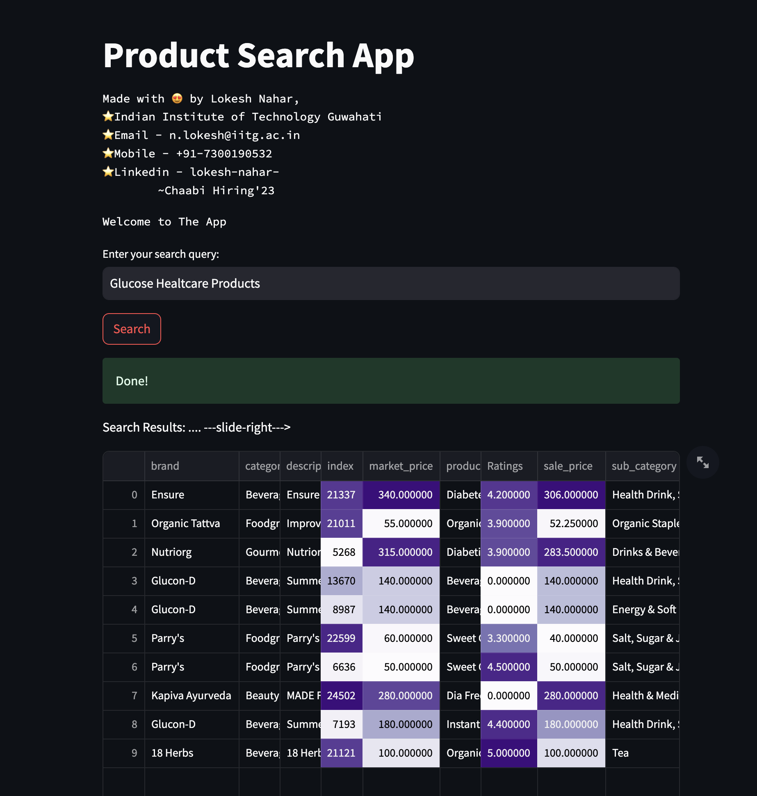
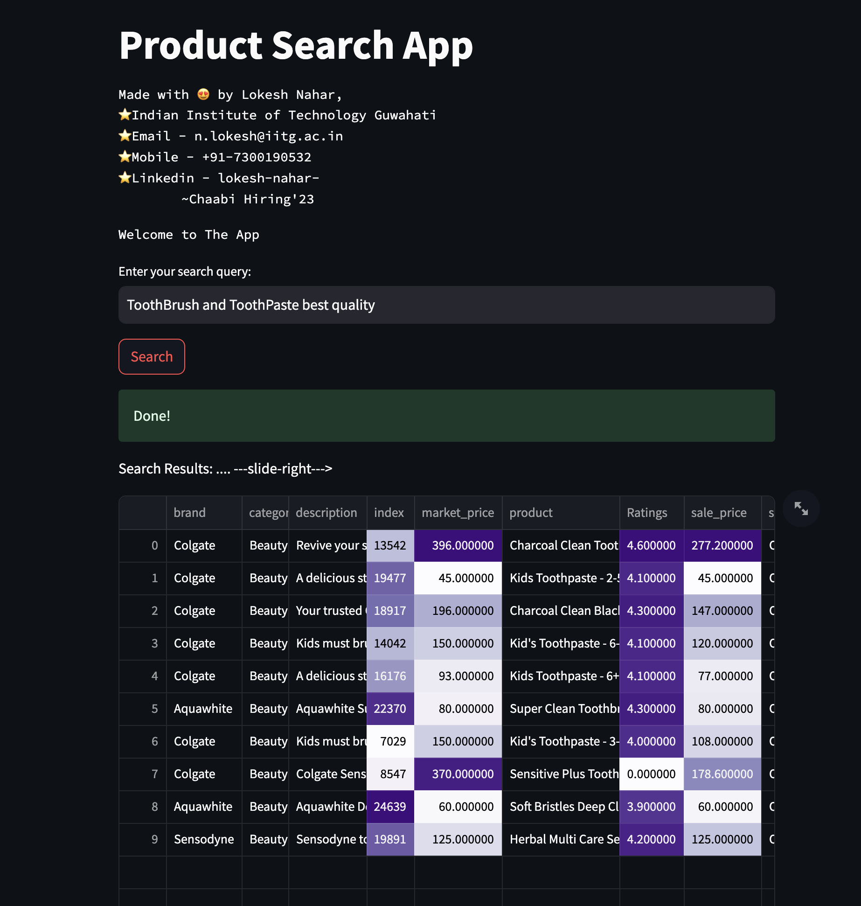

# Query Engine


**Qdrant + LLM + FastAPI + Streamlit**


Dataset used is [Big-Basket-Products-Dataset](https://chaabiv2.s3.ap-south-1.amazonaws.com/hiring/bigBasketProducts.csv)

# Requirements
Make sure you are using Python 3.X in your environment.\
Install the required dependencies using the following command:
```
pip3 install -r requirements.txt
```
Dependencies:
* [Docker](https://docs.docker.com/get-docker/)
* Sentence-Transformers (all-MiniLM-L6-v2) [Among the pre-trained models](https://www.sbert.net/docs/pretrained_models.html)
* [Qdrant-Vector-DataBase](https://qdrant.tech/)
* [FastAPI](https://fastapi.tiangolo.com/)
* [Streamlit](https://streamlit.io/)
* Pandas, Numpy, Requests


# #Start
1. Download the latest Qdrant image from Dockerhub:

```
docker pull qdrant/qdrant
```

2. Run the qdrant service (make sure port 6333 is available):

```
docker run -p 6333:6333 \
    -v $(pwd)/qdrant_storage:/qdrant/storage:z \
    qdrant/qdrant
```

Under the default configuration, all data will be stored in the ./qdrant_storage directory.

Qdrant is now accessible:
API: localhost:6333

3. To Preprocess, Generate, and Upload the vector embeddings to the qdrant Database simply by running the following command (confirm Data Path in config.py file):
```
#to generate the embeddings and then upload (make sure your system has torch.cuda)
python3 generate_upload.py --generate_embeddings
```
Note: The Embeddings are being generated using "all-MiniLM-L6-v2" model, however, if your machine's GPU resources permits, you may also use "bert-base-uncased" model to generate the embeddings and store them in the .npy file.
```
#if the embeddings are already saved (bb_chaabi_vectors.npy) in a npy file,
python3 generate_upload.py
```


4. In order to start the Fast API service, run the service.py file using the below command in a separate terminal:
```
uvicorn service:app --reload  
```


5. Finally, start the frontend web app; run the following command:
```
streamlit run frontend.py
```
Simply type in the query in the text box and press the search button.

Here are some other Search results:



***Special Thanks to Chaabi for giving the Problem Statement***

