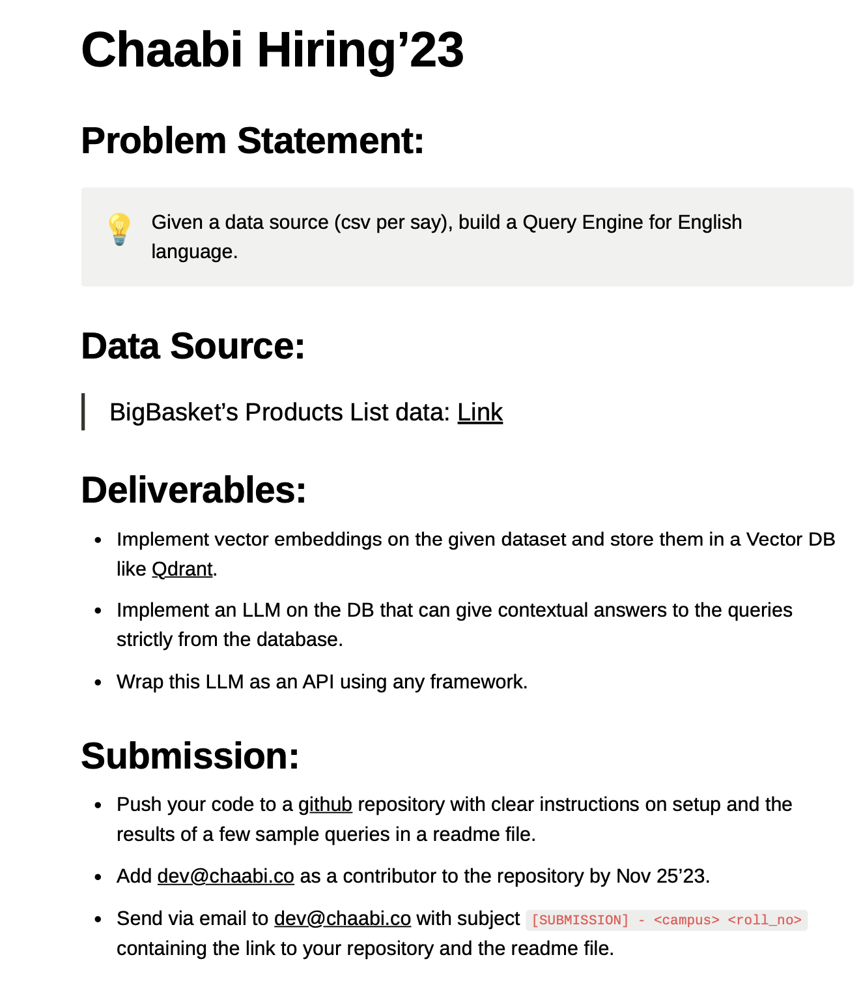

# Query Engine

**Qdrant + LLM + FastAPI + Streamlit**


Dataset used is [Big-Basket-Products-Dataset](https://chaabiv2.s3.ap-south-1.amazonaws.com/hiring/bigBasketProducts.csv)

# Requirements
Make sure you are using Python 3.X in your environment.\
Install the required dependencies using the following command:
```
pip3 install -r requirements.txt
```
The dependencies are:
* [Docker](https://docs.docker.com/get-docker/)
* [Qdrant-Vector-DataBase](https://qdrant.tech/)
* [FastAPI](https://fastapi.tiangolo.com/)
* [Streamlit](https://streamlit.io/)
* Sentence-Transformers (all-MiniLM-L6-v2)
* Pandas


# #Start
First, download the latest Qdrant image from Dockerhub:

```
docker pull qdrant/qdrant
```

Then, run the service (make sure port 6333 is available):

```
docker run -p 6333:6333 \
    -v $(pwd)/qdrant_storage:/qdrant/storage:z \
    qdrant/qdrant
```

Under the default configuration, all data will be stored in the ./qdrant_storage directory.

Qdrant is now accessible:\
API: localhost:6333

to Preprocess, Generate, and Upload the vector embeddings to the qdrant Database simply by running the following command:
```
#to generate the embeddings and then upload (make sure your OS has torch.cuda)
python3 generate_upload.py --generate_embeddings


#if the embeddings are already saved in npy file,
python3 generate_upload.py
```


In order to start the Fast API service, run the service.py file using the below command in a seperate terminal:

```
uvicorn service:app --reload  
```


to start the frontend web app run the following command:
```
streamlit run frontend.py
```


Simply type in the query in the text box and the search results.

Here are some other Search results:

***Special Thanks to Chaabi for giving the Problem Statement***

